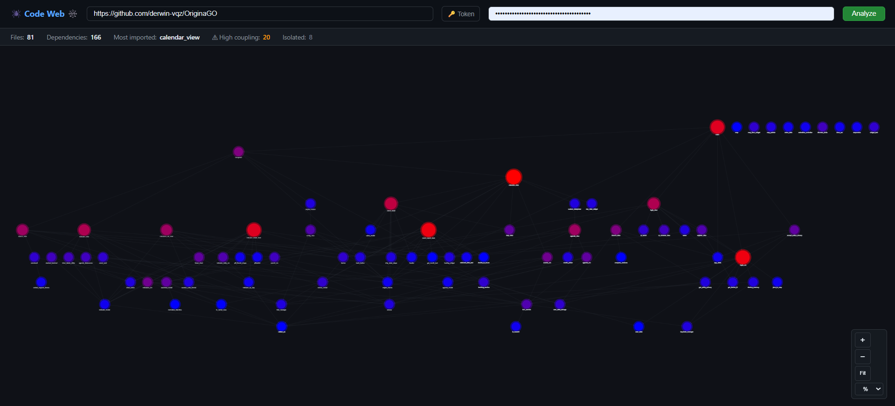
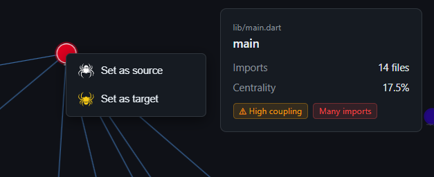
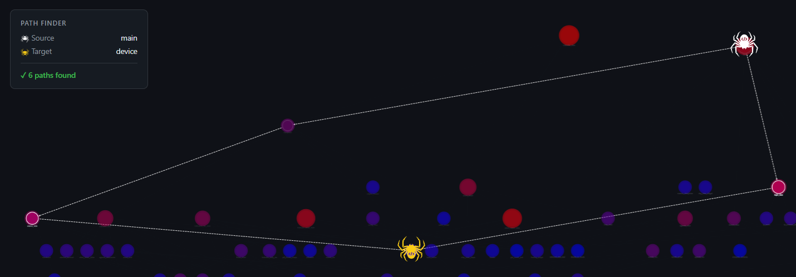

<div align="center">

# 🕸️💻 WEB Code 🕷️🕸️

Interactive dependency visualizer for GitHub repositories.

<div align="justify">

## Requirements

- Node.js 18+
- npm

## Installation

```bash
# Backend
cd server && npm install

# Frontend
cd ../client && npm install
```

## Development

Open **two terminals**:

```bash
# Terminal 1 — server (port 3001)
cd server && npm run dev

# Terminal 2 — client (port 5173)
cd client && npm run dev
```

Then open http://localhost:5173

## Usage

1. Paste a GitHub repository URL (e.g. `https://github.com/flutter/flutter`)
2. Click **Analyze**
3. Explore the graph — click any node to highlight its direct neighbours
4. The right panel shows metrics for the selected node

<picture>
  
</picture>

### Path Finder (Spider mode)

Right-click any node to open its context menu, then choose:
- **Set as source** — places the white spider 🕷 on that node.
- **Set as target** — places the yellow spider 🕷 on that node.

Once both are placed, every directed path from source to target is highlighted
with animated dashed lines. The **Path Finder** panel in the top-left shows
how many paths were found, or a "No directed path" message if none exist.
Right-clicking a new node replaces the placement.

<picture>
  
</picture>

<picture>
  
</picture>

### GitHub Token (optional)

Without a token: 60 requests/hour. With a PAT: 5 000 requests/hour.
Click **🔑 Token** to enter one. Read-only public access is sufficient.

## Structure

```
server/
  src/
    index.ts            — Express API (GET /api/repo, GET /api/health)
    github-ingester.ts  — Downloads a GitHub repo as a ZIP via codeload
    github.ts           — GitHub REST API helpers (Trees + Contents; used by
                          the commented-out /api/analyze endpoint)
    analyzer.ts         — Extracts the ZIP, parses Dart imports, builds graph
client/
  src/
    App.tsx             — Root component: form, state machine, layout
    types.ts            — Shared TypeScript types (NodeData, EdgeData, GraphData)
    utils/
      findAllPaths.ts   — DFS path-finder: all directed paths between two nodes
    components/
      GraphView.tsx     — Interactive Cytoscape.js graph canvas + spider overlays
      NodePanel.tsx     — Details panel for the selected node
      PathPanel.tsx     — Path Finder status panel (top-left)
      SpiderOverlay.tsx — Draggable spider overlay (alternative implementation)
      StatsBar.tsx      — Global graph metrics (file count, coupling, etc.)
```

## How it works

1. The client sends `GET /api/repo?repo=<url>` to the backend.
2. The backend downloads the repository as a ZIP archive from GitHub's
   codeload service (`codeload.github.com/{owner}/{repo}/zip/HEAD`).
3. The analyzer extracts the ZIP, walks the file tree, and reads every
   `.dart` file.
4. Import statements are parsed and resolved against the project's own
   file set (standard library and external packages are excluded).
5. The resulting `GraphData` — nodes (files) and edges (imports) — is
   returned as JSON and rendered in the browser.
6. The user can activate the path-finder by right-clicking two nodes.
   `findAllPaths` runs a client-side DFS over `GraphData.edges` and the
   result is highlighted directly in the graph canvas.

## Current limitations

- Only **Dart** repositories are supported (requires a `pubspec.yaml`).
- Only `dart:*`, `package:<own-project>/*`, and relative imports are
  resolved; imports from external pub packages are ignored.
- No file count cap is enforced yet (`truncated` is always `false`).

---
</div>
<div align="center"><sub>Derwin Vazquez 😎</sub></div>