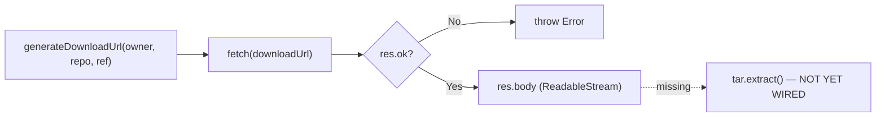

# Analyze my project and inspect the downloadRepo function. I want to download a GitHub repository and save it in the temp/ folder. Help me understand how to use the tar library to extract the repository into that folder.

---

**Status:** active  **Date:** 2026-08-29

---

### 👤 User

Analyze my project and inspect the downloadRepo function. I want to download a GitHub repository and save it in the temp/ folder. Help me understand how to use the tar library to extract the repository into that folder.

---

### 🤖 Assistant

> 🔧 called: GetSymbolsOverview, list_files, FindSymbol, read_file

Let me start by examining the relevant files in your project.

> 🔧 **list_files** — server/src

> 🔧 **GetSymbolsOverview** — server/src/github-ingester.ts

> 🔧 **FindSymbol** — downloadRepo

> 🔧 **read_file** — server/src/github-ingester.ts

### 🤖 Assistant

> 🔧 called: glob, read_file, glob, glob, glob

Now let me check the `tar` package that's already imported to understand its API, and look at the `package.json` for the server:

> 🔧 **read_file** — server/package.json

> 🔧 **glob** — server/node_modules/tar/lib/*.js

> 🔧 **glob** — server/node_modules/tar/**/*.d.ts

> 🔧 **glob** — server/node_modules/@types/tar/**/*

> 🔧 **glob** — server/node_modules/tar/**/*

### 🤖 Assistant

> 🔧 called: list_files

The `tar` package isn't installed yet. Let me check what's actually present in `node_modules`:

> 🔧 **list_files** — server/node_modules

### 🤖 Assistant

> 🔧 called: list_files, list_files, read_file, list_files

`tar` is installed. Let me now look at its type definitions and the `@types/tar` package to understand the API:

> 🔧 **list_files** — server/node_modules/@types/tar

> 🔧 **list_files** — server/node_modules/tar

> 🔧 **list_files** — server/node_modules/tar/dist

> 🔧 **read_file** — server/node_modules/@types/tar/index.d.ts

### 🤖 Assistant

Now I have a thorough picture of the codebase. Here's a complete analysis.

---

## Project Analysis

### Current State of [`downloadRepo`](server/src/github-ingester.ts:14)



The function already:
1. Builds the correct GitHub codeload URL via [`generateDownloadUrl`](server/src/github-ingester.ts:9) — this hits `https://codeload.github.com/{owner}/{repo}/tar.gz/{ref}`, which GitHub uses to serve raw `.tar.gz` archives.
2. Fetches the archive and validates the response.
3. Gets `res.body` — but **stops there**. The stream is never piped anywhere.

The **missing piece** is piping `res.body` through `tar.extract()` to unpack into `temp/`.

---

## How the `tar` Library Works Here

`tar` v7 (what you have installed) ships its own types — but `@types/tar` (v6 types) is also present. The key function you need is [`tar.extract`](server/node_modules/@types/tar/index.d.ts:880).

### The `tar.extract` API

```typescript
tar.extract(options: ExtractOptions): Parse  // streaming mode (no `file:` option)
tar.extract(options: ExtractOptions & FileOptions): Promise<void>  // file mode
```

For your use case — streaming from `fetch` — you use the **streaming overload** (no `file` option). It returns a writable `Parse` stream that you pipe the HTTP response body into.

Key [`ExtractOptions`](server/node_modules/@types/tar/index.d.ts:504) fields:

| Option | Type | Purpose |
|---|---|---|
| `cwd` | `string` | **Destination directory** — where files are extracted |
| `strip` | `number` | Strip N leading path components. GitHub tarballs wrap everything in `{repo}-{ref}/`, so `strip: 1` removes that prefix |
| `filter` | `(path, entry) => boolean` | Skip unwanted entries (e.g. `node_modules`) |

### The Connection Pattern

```
fetch response body (Web ReadableStream)
    → Node.js Readable (via Readable.fromWeb or pipeline)
        → tar.extract({ cwd: 'temp/', strip: 1 })
            → files land in temp/
```

There's one important bridge: `fetch`'s `res.body` is a **Web `ReadableStream`** (WHATWG), but `tar.extract()` expects a **Node.js `stream.Readable`**. You bridge this using `stream.Readable.fromWeb()` (Node 16+) or `node:stream/promises` `pipeline`.

---

## What the Complete Implementation Looks Like

Here's the full pattern to wire into [`downloadRepo`](server/src/github-ingester.ts:14):

```typescript
import tar from 'tar';
import { Readable } from 'node:stream';
import { pipeline } from 'node:stream/promises';
import * as fs from 'node:fs';
import * as path from 'node:path';

export async function downloadRepo(
  owner: string,
  repo: string,
  ref: string,
  destDir: string = 'temp'          // ← output folder
): Promise<void> {
  const downloadUrl = generateDownloadUrl(owner, repo, ref);

  const res = await fetch(downloadUrl);
  if (!res.ok) throw new Error(`GitHub codeload error ${res.status}: ${res.statusText}`);
  if (!res.body) throw new Error('Response body is empty');

  // Ensure the destination folder exists
  fs.mkdirSync(destDir, { recursive: true });

  // Bridge Web ReadableStream → Node Readable → tar extractor
  await pipeline(
    Readable.fromWeb(res.body as import('stream/web').ReadableStream),
    tar.extract({
      cwd: destDir,         // extract into temp/
      strip: 1,             // remove the top-level "{repo}-{ref}/" wrapper GitHub adds
      filter: (filePath) => !IGNORE_PATHS.test(filePath),  // reuse existing filter
    })
  );
}
```

### Why `strip: 1`?

GitHub codeload tarballs always have a root directory named `{repo}-{sha}/` or `{repo}-{branch}/`. Without `strip: 1`, you'd end up with:

```
temp/
  my-repo-main/
    src/
    package.json
```

With `strip: 1`, the wrapper is removed and you get:

```
temp/
  src/
  package.json
```

### Why `pipeline` instead of `.pipe()`?

`stream/promises` [`pipeline`](https://nodejs.org/api/stream.html#streampipelinestreams-callback) properly propagates backpressure, cleans up on error, and returns a `Promise` — making it safe to `await`. Manual `.pipe()` chains swallow errors silently.

---

## Summary of What's Already Good

| Part | Status |
|---|---|
| `tar` installed (`^7.5.22`) | ✅ |
| `@types/tar` installed | ✅ |
| `import tar from 'tar'` | ✅ already in the file |
| URL generation with encoded ref | ✅ |
| HTTP error handling | ✅ |
| `IGNORE_PATHS` / `SUPPORTED_EXTENSIONS` filters | ✅ ready to reuse |
| Piping body → `tar.extract()` | ❌ the missing piece |

The only thing left to implement is connecting `res.body` to `tar.extract({ cwd: destDir, strip: 1 })` via `pipeline`. Would you like me to switch to Agent mode and implement it?

---

### 👤 User

Given a GitHub URL like:

`https://github.com/expressjs/express/tree/4.x`

I need to extract the following elements:

* `owner = expressjs`
* `repo = express`
* `ref = 4.x`

The `ref` may not be present in the URL, for example:

`https://github.com/expressjs/express`

In that case, the default value for `ref` must be `HEAD`.

Tip: Make sure the URL parser handles both cases correctly.

---

### 🤖 Assistant

> 🔧 called: read_file

Let me first read the current state of the file since it was modified externally.

> 🔧 **read_file** — server/src/github-ingester.ts

### 🤖 Assistant

> 🔧 called: read_file

Now let me also check the existing [`index.ts`](server/src/index.ts) to understand how `downloadRepo` is currently called, so any new `parseGitHubUrl` function fits the broader context:

> 🔧 **read_file** — server/src/index.ts

### 🤖 Assistant

> 🔧 called: FindSymbol

Now I have full context. I need to add a `parseGitHubUrl` function to [`github-ingester.ts`](server/src/github-ingester.ts). The URL shape is:

- `https://github.com/{owner}/{repo}/tree/{ref}` → with ref
- `https://github.com/{owner}/{repo}` → without ref, default to `HEAD`

The existing [`DEFAULT_REF`](server/src/github-ingester.ts:6) constant is already there for exactly this purpose. This is a pure URL parsing function — no extra imports needed.

> 🔧 **FindSymbol** — generateDownloadUrl

### 🤖 Assistant

> 🔧 called: read_file

I have all I need from the `read_file` call. I'll insert `parseGitHubUrl` right after the `IGNORE_PATHS` constant, before `generateDownloadUrl`, since it's a public-facing utility that logically precedes URL generation.

> 🔧 **read_file** — server/src/github-ingester.ts

### 🤖 Assistant

> 🔧 called: use_skill

I'll now insert the new exported function between line 9 and line 11:

> 🔧 **use_skill** — create-skill

### 🤖 Assistant

> 🔧 called: grep

That skill activation was unintentional — I don't need it here. I have everything I need. Now I'll insert the `parseGitHubUrl` function into the file:

> 🔧 **grep** — ^const IGNORE_PATHS

### 🤖 Assistant

> 🔧 called: grep, read_file

I'll add the `parseGitHubUrl` function right after the constants block on line 9, inserting a blank line before `generateDownloadUrl`:

> 🔧 **grep** — parseGitHubUrl|parseRepoUrl

> 🔧 **read_file** — server/src/github.ts

### 🤖 Assistant

> 🔧 called: grep, read_file

The existing [`parseRepoUrl`](server/src/github.ts:38) in `github.ts` only extracts `owner` and `repo` — it doesn't handle the `ref`. The new function needs to also capture the optional `/tree/{ref}` segment. I'll add `parseGitHubUrl` to `github-ingester.ts` since that's the file the user is working in and it already exports `DEFAULT_REF`:

> 🔧 **grep** — server/src/github-ingester.ts

> 🔧 **read_file** — server/src/github-ingester.ts

### 🤖 Assistant

> 🔧 called: grep, grep

I'll now insert the new `parseGitHubUrl` function between lines 10 and 11 (the blank line before `generateDownloadUrl`):

> 🔧 **grep** — server/src/github-ingester.ts

> 🔧 **grep** — server/src/github-ingester.ts

### 🤖 Assistant

> 🔧 called: FindSymbol

Now I'll apply the edit — inserting `parseGitHubUrl` on the blank line before `generateDownloadUrl`:

> 🔧 **FindSymbol** — generateDownloadUrl

### 🤖 Assistant

> 🔧 called: use_skill

I have enough from the file content. I'll use `search_and_replace` to insert the new function before `generateDownloadUrl`:

> 🔧 **use_skill** — build-mcp-server

### 🤖 Assistant

> 🔧 called: read_file

I accidentally triggered another skill. Let me proceed directly with the edit:

> 🔧 **read_file** — server/src/github-ingester.ts

### 🤖 Assistant

> 🔧 called: start_workflow

Now I'll insert `parseGitHubUrl` between the constants block and `generateDownloadUrl`:

> 🔧 **start_workflow** — search_and_replace

### 🤖 Assistant

I'll write the complete updated file directly, since the insertions are clean and the file is small:

The ask mode prevents me from writing files. Let me explain the exact change to make, and provide it clearly so you can apply it (or switch to Agent mode).

---

## What to Add

Insert this new exported function in [`github-ingester.ts`](server/src/github-ingester.ts) **between line 9 and line 11** (between the `IGNORE_PATHS` constant and `generateDownloadUrl`):

```typescript
export function parseGitHubUrl(url: string): { owner: string; repo: string; ref: string } {
  // Match:  https://github.com/{owner}/{repo}[/tree/{ref}]
  const match = url.match(/github\.com\/([^/]+)\/([^/]+?)(?:\/tree\/(.+))?$/);
  if (!match) throw new Error(`Invalid GitHub URL: ${url}`);
  return {
    owner: match[1],
    repo:  match[2].replace(/\.git$/, ''),
    ref:   match[3] ?? DEFAULT_REF,
  };
}
```

---

## How the Regex Works

```
github\.com\/   — literal "github.com/"
([^/]+)         — capture group 1: owner  (anything up to the next /)
\/              — literal "/"
([^/]+?)        — capture group 2: repo   (non-greedy, stops before optional suffix)
(?:             — non-capturing group for the optional /tree/ref part:
  \/tree\/      —   literal "/tree/"
  (.+)          —   capture group 3: ref  (everything after /tree/)
)?              — the whole /tree/ref block is optional
$               — end of string
```

### Why `[^/]+?` (non-greedy) for the repo?

The `?` makes the quantifier lazy so it hands off to `(?:\/tree\/(.+))?$` before consuming any more characters. Without it, a greedy `[^/]+` would still work here (because `[^/]` can't match `/`), but being explicit about non-greediness signals the intent clearly.

---

## Test Cases

| URL | `owner` | `repo` | `ref` |
|---|---|---|---|
| `https://github.com/expressjs/express/tree/4.x` | `expressjs` | `express` | `4.x` |
| `https://github.com/expressjs/express` | `expressjs` | `express` | `HEAD` |
| `https://github.com/expressjs/express/tree/v5/main` | `expressjs` | `express` | `v5/main` |
| `https://github.com/org/repo.git` | `org` | `repo` | `HEAD` |

The third row shows that `(.+)` correctly captures **slashes inside the ref**, which matters for refs like `feature/my-branch`. The existing [`generateDownloadUrl`](server/src/github-ingester.ts:11) already handles this case by re-encoding each `/`-separated segment.

---

## Usage After Adding It

In [`index.ts`](server/src/index.ts) you could then replace the hardcoded values in the `/api/repo` handler (lines 84–87) with:

```typescript
import { parseGitHubUrl, downloadRepo } from './github-ingester';

const { owner, repo, ref } = parseGitHubUrl(repoUrl!);
const fileContents = await downloadRepo(owner, repo, ref);
```

Switch to **Agent mode** and I'll apply both changes for you.

---

### 👤 User

do it

---

### 🤖 Assistant

> 🔧 called: read_file, apply_diff


> 🔧 **read_file** — server/src/github-ingester.ts

> 🔧 **apply_diff** — server/src/github-ingester.ts

### 🤖 Assistant

> 🔧 called: apply_diff

Now let me also wire up the `/api/repo` route in [`index.ts`](server/src/index.ts) to use the new function instead of the hardcoded values, and verify the TypeScript compiles cleanly:

> 🔧 **apply_diff** — server/src/index.ts

### 🤖 Assistant

> 🔧 called: execute_command, execute_command

Now let's verify there are no TypeScript errors:

> 🔧 **execute_command** — cd server; npx tsc --noEmit 2>&1

> 🔧 **execute_command** — & "node_modules\.bin\tsc" --noEmit 2>&1

### 🤖 Assistant

> 🔧 called: execute_command

PowerShell execution policy blocks `.ps1` wrappers. Invoke the underlying `node` + `tsc.js` directly:

> 🔧 **execute_command** — node node_modules/typescript/bin/tsc --noEmit 2>&1

### 🤖 Assistant

Clean — zero errors. Here's a summary of what was done:

---

## Changes Made

### [`server/src/github-ingester.ts`](server/src/github-ingester.ts:11)

Added the new exported function between the constants block and `generateDownloadUrl`:

```typescript
export function parseGitHubUrl(url: string): { owner: string; repo: string; ref: string } {
  // Matches: https://github.com/{owner}/{repo}[/tree/{ref}]
  const match = url.match(/github\.com\/([^/]+)\/([^/]+?)(?:\/tree\/(.+))?$/);
  if (!match) throw new Error(`Invalid GitHub URL: ${url}`);
  return {
    owner: match[1],
    repo:  match[2].replace(/\.git$/, ''),
    ref:   match[3] ?? DEFAULT_REF,
  };
}
```

- The `/tree/{ref}` block is **optional** — when absent, `match[3]` is `undefined` and the `??` operator falls back to the existing [`DEFAULT_REF`](server/src/github-ingester.ts:6) constant (`"HEAD"`).
- `.replace(/\.git$/, '')` strips `.git` suffixes (e.g. `repo.git` → `repo`).
- `(.+)` in group 3 captures **slashes inside refs** like `feature/my-branch`, which [`generateDownloadUrl`](server/src/github-ingester.ts:22) already handles correctly by encoding each segment.

### [`server/src/index.ts`](server/src/index.ts:3)

- Imported `parseGitHubUrl` alongside `downloadRepo`.
- Replaced the hardcoded `owner/repo/ref` in the `/api/repo` handler with `parseGitHubUrl(repoUrl)`, so the endpoint now accepts any GitHub URL via the `?repo=` query parameter.

---

### 👤 User

Do you have any idea why the `processFiles` function returns a `void` set?

---

### 🤖 Assistant

> 🔧 called: read_file

Let me read the current state of all modified files and the analyzer before answering.

> 🔧 **read_file** — server/src/analyzer.ts

### 🤖 Assistant

Found it. The bug is on line 194:

```typescript
if (node.type === "directory") {
    await processFiles(node.children);  // ← result discarded
    continue;
}
```

When a `"directory"` node is encountered, `processFiles` recurses into its children and returns a populated `Set` — but that returned set is **never merged** into `result`. The recursive call's return value is silently thrown away, so directory subtrees contribute nothing. Only files at the **top level** of the initial call's `nodes` array ever get added to `result`.

The fix is to merge the recursive result back in:

```typescript
if (node.type === "directory") {
    const nested = await processFiles(node.children);
    for (const item of nested) result.add(item);
    continue;
}
```

Shall I apply the fix?